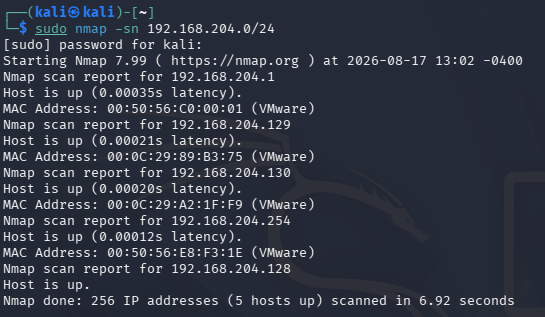
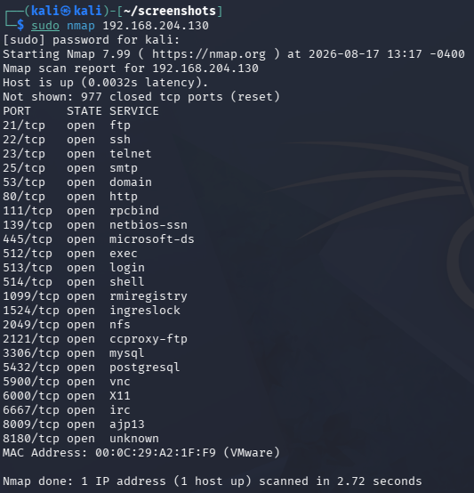
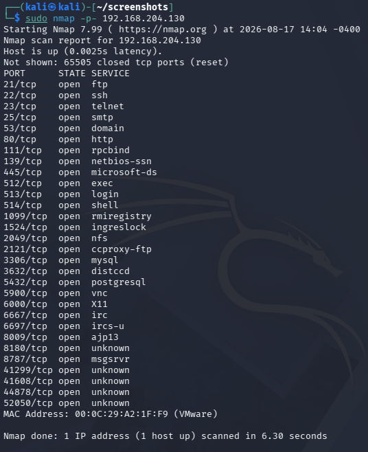
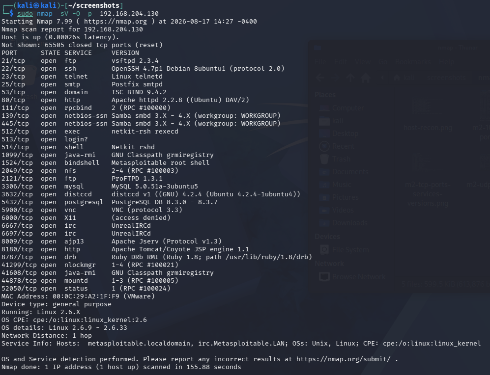
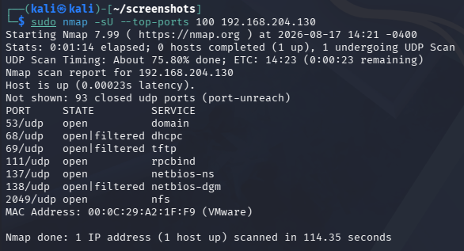
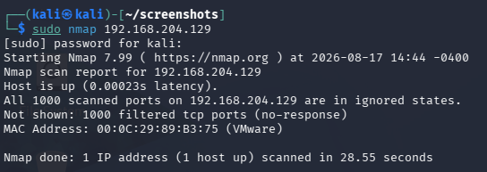

# Nmap Network Reconnaissance

## Objective

The objective of this lab was to practice network reconnaissance using Nmap within my isolated VM environment. The sequence taken is as follows: discovering active hosts, identifying open TCP and UDP ports, detecting services and software versions, performing OS detection, and analyzing the resulting attack surface.

The VMs are abbreviated as KL (Kali Linux), W10 (Windows 10), and M2 (Metasploitable 2).

For details about the lab environment and network architecture, you can visit [Lab Setup](../../lab-setup/README.md).

## Commands Used

| Command | Purpose |
|---|---|
| `nmap -sn 192.168.204.0/24` | Identify active hosts on the lab network |
| `nmap 192.168.204.x` | Scan the 1000 most common TCP ports |
| `nmap -p- 192.168.204.x` | Scan all TCP ports |
| `nmap -sV 192.168.204.x` | Identifies the services and versions running on open TCP ports |
| `nmap -O 192.168.204.x` | Attempt to identify the target's operating system |
| `nmap -sU --top-ports 100 192.168.204.x` | Scan the 100 most common UDP ports |
| `nmap -sV -O -p- 192.168.204.x` | Combines full TCP, service, and OS detection |

## Host Discovery

Nmap was first used to identify active hosts on the isolated lab network.

The scan identified five active hosts:

| IP Address | Identity |
|---|---|
| `192.168.204.1` | VMware component |
| `192.168.204.128` | Kali Linux |
| `192.168.204.129` | Windows 10 |
| `192.168.204.130` | Metasploitable 2 |
| `192.168.204.254` | VMware component |

This scan confirmed that all three machines were reachable on the isolated network. Additionally, it identified two additional hosts on the network. Further research determined that these were VMware infrastructure components. 

## Nmap Scans On M2

### Initial Scan

The lab was initiated with Nmap scans on an intentionally vulnerable system. The default Nmap command scanned the top 1000 most common TCP ports:

This scan identified 23 open TCP ports, exposing a wide range of services on the M2 VM. The following table lists some of these services and their associated purposes:

| Port | Service | Purpose |
|---:|---|---|
| 21 | FTP | File transfers |
| 22 | SSH | Remote access to Linux/Unix |
| 53 | Domain | DNS service |
| 80 | HTTP | Web server (non-encrypted) |
| 514 | Shell | Remote shell access |
| 3306 | MySQL | Database |
| 5432 | PostgreSQL | Database | 

### Full TCP scan

The default scan only examines Nmap's 1000 most common TCP ports so an exhaustive TCP port scan was performed. This revealed seven additional open ports, demonstrating the importance of scanning beyond commonly used ports:

### Services, Versions, and Operating Systems

Next, service and OS detection was used to identify the software/versions running on open ports and estimate the VM's OS:

This provided significantly more information than the initial scan. For example, Nmap identified ISC BIND version 9.4.2 running on port 53/tcp.

### UDP Port Scan

UDP scanning was significantly slower than TCP scanning, and further research explained that this is due to the lack of acknowledgment replies which are present in the TCP handshake process. After the initial scan took too long to complete, a more limited scan of the top 100 most common ports was conducted:

This scan demonstrated that UDP services can also contribute to a host's attack surface. It also showed that the same port number can be open over both TCP and UDP protocols.

### Attempted Nmap Scan of W10

A full TCP scan resulted in all 1000 scanned ports being classified as filtered:

A limited UDP scan also produced no identifiable open ports.

## Attack Surface Analysis

Nmap revealed a substantial difference in network exposure between M2 and W10.

### Metasploitable 2

The full TCP scan identified 30 open TCP ports and services associated with remote admin services/access, file transfer services, web servers, network file sharing, databases, remote graphical access, and other functionalities.

Nmap also identified specific software and their versions that were running on many of these open ports. For example, port 53/tcp was running ISC BIND version 9.4.2.

Together, the above findings represent a substantial potential attack surface. In a real assessment, these findings would prompt further vulnerability and configuration analysis, followed by efforts to reduce unnecessary exposure.

### Windows 10

Although the host was confirmed to be reachable, all 1000 TCP ports in the default scan were classified as filtered because Nmap received no responses.

The lack of identifiable open ports was a significant contrast to M2 and demonstrates how firewall configuration can limit the information available to a potential attacker.
 
## Lessons Learned

- Reconnaissance (via Nmap) helps identify exposed ports and services on a host machine.
- Scanning all ports can reveal services that would be missed by a default scan.
- Service and version detection provides valuable information for further analysis.
- Exposed services can increase the potential attack surface and warrant further analysis.
