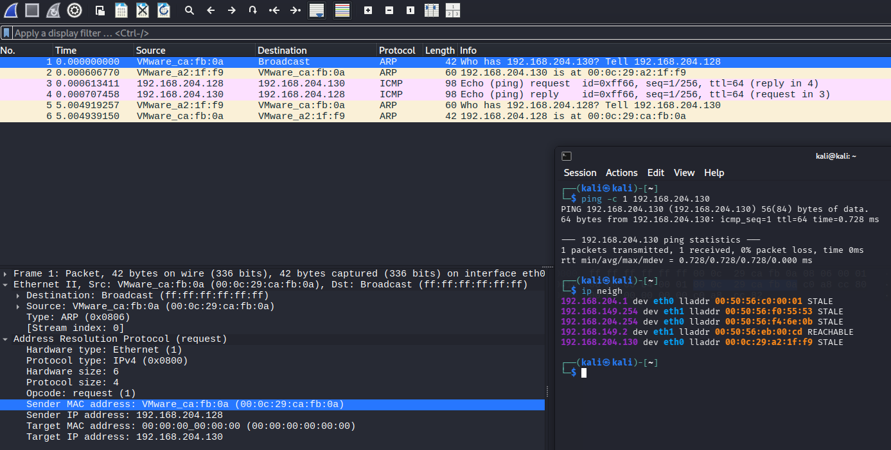
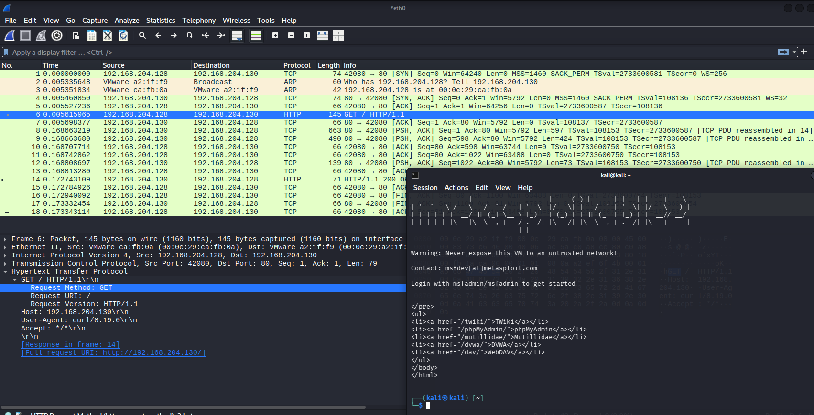
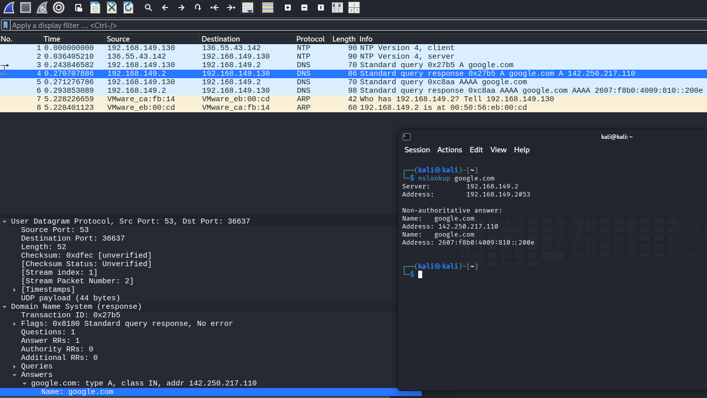
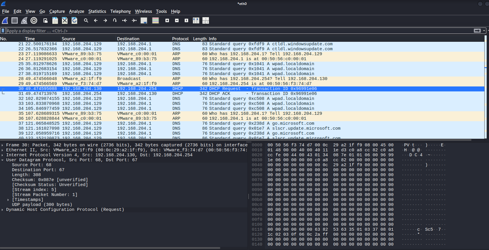
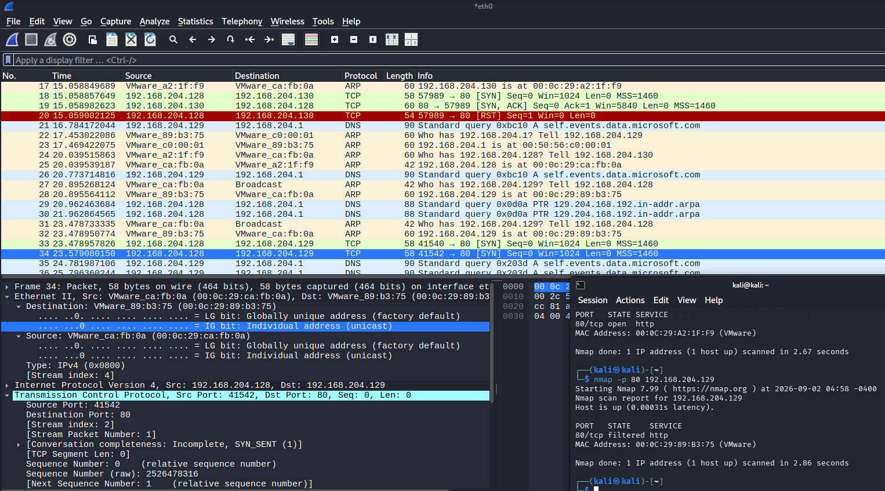
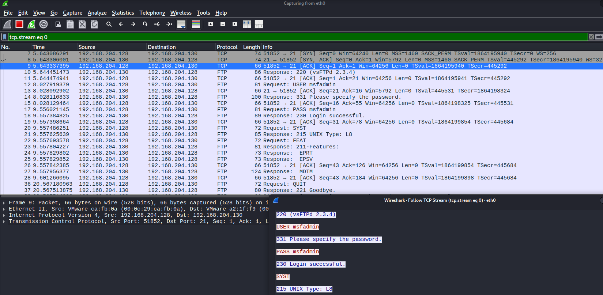
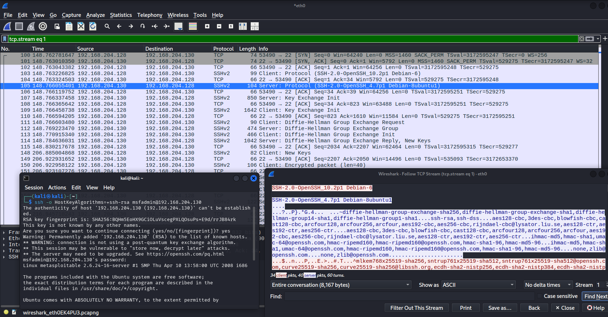

# Wireshark Network Traffic Analysis

## Objective

The objective of this lab was to analyze network traffic using Wireshark within an isolated VM environment. Packet captures were used to examine ARP, ICMP, TCP, HTTP, DNS, FTP, Telnet, and SSH traffic while comparing passive and active reconnaissance against different hosts.

The VMs are abbreviated as KL (Kali Linux), W10 (Windows 10), and M2 (Metasploitable 2).

For details about the lab environment and network architecture, you can visit [Lab Setup](../../lab-setup/README.md).

## ARP Analysis

ARP traffic was captured between KL and M2 to observe how an IPv4 address is resolved to a MAC address on the local network.

This shows KL generated an ARP request asking which device owned address `192.168.204.130`. M2 responded with its MAC address, which was then stored in KL's neighbor table.

## HTTP Analysis

HTTP traffic was then generated by requesting M2's web page. Because HTTP is the non-encrypted version, Wireshark was able to inspect the HTTP request and response directly.

This also demonstrates how traffic can disclose information about the software and versions running on a remote host.

## DNS and UDP Analysis

DNS traffic was captured on KL's `eth1` interface while resolving an external domain to google.com.

KL sent DNS queries using UDP destination port 53. This exercise demonstrates that `eth1` is not isolated from the internet as `eth0` intentionally is.

Unlike the TCP connections observed previously, the DNS exchange did not require a three-way handshake since it utilized UDP instead.

## Passive Reconnaissance

Traffic from M2 and W10 was observed without intentionally generating any network activity from KL.

During an observation period of approximately five minutes, M2 generated very little observable traffic, with only a single DHCP exchange captured. W10 generated substantially more background traffic, including DNS requests associated with Windows services.

This contrasted with the earlier Nmap results. Active scanning revealed many exposed services on M2, despite it generating almost zero traffic during passive observation. W10 generated significantly more passive traffic while providing considerably less information in response to active port scanning.

This demonstrated that the amount of passive network activity generated by a host does not necessarily correspond to the size of its observable attack surface.

## Active Reconnaissance Analysis

Wireshark was used alongside Nmap to examine packet-level behavior behind different ports.

When TCP port 80 on M2 was scanned, the following exchange occurred:

`SYN` → `SYN, ACK` → `RST`

M2's `SYN, ACK` response demonstrated that the port was accepting TCP connections and Nmap classified the port as open. Nmap terminated its probe with a `RST` rather than establishing an application session.

When the same port on W10 was scanned, KL transmitted TCP `SYN` packets but received no TCP response. Nmap retried the probe and ultimately classified the port as filtered.

The capture demonstrated how packet analysis can help explain Nmap's results. An open port responded to the TCP connection attempt, while presumed filtering, perhaps from the W10 firewall, prevented Nmap from receiving enough information to determine whether the corresponding W10 port was open or closed.

## Plaintext Protocol Analysis

### FTP

M2's FTP service was accessed through TCP port 21. Upon connection, the service showed the following:

`220 (vsFTPd 2.3.4)`

This exposed the FTP server software and version even before authentication occurred.

A login was then performed using M2's intentionally insecure default credentials. Wireshark captured the FTP `USER` and `PASS` commands, and both values could be read directly from the packet capture and reconstructed TCP stream.

This demonstrated that traditional FTP does not provide encryption for authentication credentials and that an observer capable of capturing the traffic may be able to recover them entirely.

### Telnet

Remote terminal access to M2 was also tested using Telnet through TCP port 23.

With Wireshack, individual keystrokes and returned terminal data were observable in the capture, allowing the session to be reconstructed.

Just like with FTP, this demonstrates the security risks associated with transmitting application data using unsecure protocols when encrypted options are available.

## SSH Comparison

SSH was used to establish an encrypted remote terminal session with M2 through TCP port 22.

Initially it did not work due to legacy SSH, and through research it was discovered that one can enable the `ssh-rsa` host-key algorithm instead, allowing the session to proceed. This was only done for the purpose of the lab experiment and should not be done in practice.

Wireshark could observe the TCP connection and initial SSH identification strings, including information about the SSH implementations being used. After that, however, the terminal session contents were encrypted.

Unlike Telnet, following the SSH TCP stream did not expose the password, commands, or command output in a readable form. This demonstrated that encryption protects the contents of a remote session even though metadata such as IP addresses, ports, protocol information, packet sizes, and timing remain observable.

## Security Analysis

The packet captures demonstrated that network traffic can provide substantial reconnaissance information beyond simply identifying communicating hosts.

Unencrypted exposed information including HTTP server software, FTP service versions, authentication credentials, and interactive terminal data, and information on software versions.

The comparison between M2 and W10 also demonstrated the effect of network filtering. M2 responded directly to TCP probes and exposed numerous services, while W10 frequently provided no response to equivalent probes, limiting the information available through active reconnaissance.

Finally, the comparison between Telnet and SSH demonstrated the importance of using encrypted protocols when they are available.

## Lessons Learned

- Wireshark can be used to inspect traffic at multiple layers of the network stack.
- TCP uses a three-way handshake to establish connections, while UDP does not.
- Application protocols and banners can disclose software and version information.
- Passive and active reconnaissance can reveal substantially different information about the same host.
- Packet analysis can help explain why ports are classified as open, closed, or filtered during scanning.
- Unencrypted protocols such as FTP and Telnet can expose sensitive information to network observers.
- Firewall filtering can significantly reduce the information available through active reconnaissance.
